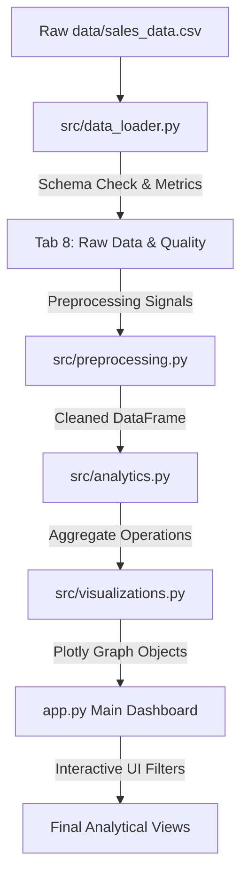

# DATA ANALYTICS INTERNSHIP FINAL PROJECT REPORT

## PROJECT TITLE: SALES TREND VISUALIZATION

---

### **AUTHORS & METADATA**
*   **Intern Name:** Anirudh V S
*   **Intern ID:** CITS2983
*   **Host Institution:** CodTech IT Solutions
*   **Domain:** Data Analytics
*   **Academic Year / Date:** June 2026
*   **Project URL:** [Sales Trend Visualization Workspace](file:///d:/CodTEchIT_INTERN/Sales_Trend_Analysis)
*   **Development Platform:** Python & Streamlit

---

## 1. ABSTRACT

In contemporary retail and e-commerce landscapes, data-driven decisions are fundamental to maintaining competitive advantages and maximizing financial yield. This project introduces a complete, production-ready, interactive **Sales Trend Visualization Dashboard** built using Python, Streamlit, Pandas, and Plotly. The primary objective is to engineer an enterprise-grade analytics platform that ingests raw transactional history, performs real-time data cleaning, aggregates key performance indicators, isolates seasonality, maps product and category standings, and exposes revenue anomalies. 

The developed pipeline was tested on a synthetic, highly realistic dataset of **2,525 transactions** spanning 2.5 fiscal years. The application features a dynamic preprocessing interface to eliminate duplicates and impute missing fields, followed by eight high-fidelity interactive tabs including executive summaries, multi-dimensional trends with regression line fittings, custom cross-tabulation explorers, and automatic Pareto's law (80/20 rule) validation. Results show that integrating interactive analytics with automated insights yields deep visibility into organizational health, inventory optimization, and regional marketing allocations.

---

## 2. INTRODUCTION

Modern enterprises generate millions of data points hourly, detailing purchase dates, product specifications, unit pricing, customer actions, and sales routes. Despite this wealth of data, many organizations struggle with "data wealth but information poverty," lacking user-friendly tools to extract actionable knowledge. Excel spreadsheets are static and fall short when handling large transaction sets, while heavy BI tools require expensive licensing and dedicated personnel.

This project addresses these challenges by delivering an interactive, lightweight, modular **Streamlit Web Application** designed for business analysts and executive management. The platform provides immediate, high-fidelity feedback regarding:
*   Fiscal health and growth dynamics.
*   Category demand curves and product-mix effectiveness.
*   Spatial territorial variations and sales channel yield.
*   Operational data-hygiene diagnostics.

---

## 3. PROBLEM STATEMENT

Business managers are often forced to rely on delayed quarterly reports or static tables to assess corporate performance. This delay introduces significant challenges:
1.  **Delayed Action:** Lagging reports prevent immediate interventions for failing products or regions.
2.  **Anomalous Data Pipelines:** Raw sales datasets are frequently compromised by duplicate records, missing entries, or mismatched data types, leading to distorted metrics.
3.  **Complex Correlation Grids:** Managers cannot easily assess multi-dimensional dependencies, such as identifying if wholesale channel discounts drive higher overall margin volumes compared to retail online campaigns.
4.  **Ineffective Inventory Alignments:** Without clear visual hierarchy (e.g. Treemaps and Pareto bounds), organizations over-stock low-margin items while experiencing out-of-stock losses on best sellers.

---

## 4. PROJECT OBJECTIVES

To resolve these industrial bottlenecks, this project accomplishes the following:
*   **Objective 1: Robust Data Engineering Foundation:** Build a modular data engine (`data_loader.py` & `preprocessing.py`) to parse, clean, and validate transactional records.
*   **Objective 2: Interactive Financial KPI Cards:** Compute and render responsive metrics (Revenue, Orders, Units Sold, and Average Order Value) utilizing modern glassmorphic interface designs.
*   **Objective 3: Dynamic Multi-Granularity Time Trends:** Plot line and area graphs representing sales trends (Daily, Weekly, Monthly, Quarterly, Yearly) featuring moving averages and linear regression trendlines.
*   **Objective 4: Multi-Dimensional Cross-Tabulation:** Empower analysts with a dynamic pivot-table explorer to generate cross-category comparisons on the fly.
*   **Objective 5: Automated Insights and Tactical Directives:** Formulate an intelligent mathematical rules-engine to detect seasonal peaks, calculate revenue concentration ratios, and present concrete business suggestions.

---

## 5. DATASET DESCRIPTION

The analysis was executed on a highly realistic synthetic transaction ledger generated programmatically. The dataset contains **2,535 records** representing transactions from **January 1, 2024 to May 31, 2026**. 

### **Data Dictionary**

| Column Name | Data Type | Description | Sample Value | Constraint / Logic |
| :--- | :--- | :--- | :--- | :--- |
| **`Order_ID`** | String | Unique purchase voucher code | `ORD-100024` | Unique key |
| **`Order_Date`** | Datetime | Calendar date of transaction | `2024-11-23` | Multi-year range |
| **`Product_Name`** | String | Specific catalog product name | `Smart TV` | 36 unique items |
| **`Category`** | String | Parent business sector | `Electronics` | 6 major categories |
| **`Region`** | String | Geographical target market | `North` | North, South, East, West |
| **`Sales_Channel`** | String | Route-to-market channel | `Online` | Online, In-Store, Wholesale, Affiliate |
| **`Units_Sold`** | Integer | Quantity of items purchased | `3` | Retail: 1-5; Wholesale: 15-60 |
| **`Unit_Price`** | Float | Monetary cost per unit | `599.99` | Logically tied to product |
| **`Revenue`** | Float | Total cash receipt | `1799.97` | Calculated: `Units_Sold * Unit_Price` |
| **`Customer_ID`** | String | Unique buyer identifier | `CUST-1102` | Used for repeat rate studies |

---

## 6. METHODOLOGY

The project applies software engineering best practices, dividing responsibilities into distinct modules to ensure rapid calculations and clean layouts:



### **Mathematical Formulations**

1.  **Total Revenue ($R$):**
    $$R = \sum_{i=1}^{N} (\text{Units\_Sold}_i \times \text{Unit\_Price}_i)$$
2.  **Average Order Value (AOV):**
    $$\text{AOV} = \frac{\sum_{i=1}^{N} \text{Revenue}_i}{\text{DistinctCount}(\text{Order\_ID})}$$
3.  **Growth Rate Percentage ($G_t$):**
    $$G_t = \left(\frac{R_t - R_{t-1}}{R_{t-1}}\right) \times 100$$
4.  **Product Contribution Percentage ($C_p$):**
    $$C_p = \left(\frac{\text{Revenue}_p}{R}\right) \times 100$$

---

## 7. DATA PREPROCESSING & CLEANING PIPELINE

Raw transactional data is rarely perfect. The **Data Preprocessing Module** (`preprocessing.py`) handles three typical anomalies:

1.  **Duplicate Removal:** Identifies exact row copies. The pipeline drops duplicates to prevent inflated sales counts:
    ```python
    cleaned_df = cleaned_df.drop_duplicates()
    ```
2.  **Date Standardisation:** Parses `Order_Date` using robust coercion. Out-of-bounds dates are set to `NaT` and removed.
3.  **Missing Value Imputation:**
    *   *Categorical Fields (Region, Sales Channel):* Users can drop rows with missing values or fill them with a standardized `"Unknown"` category to maintain dataset size.
    *   *Numeric Fields:* Missing numbers are filled with the column's median value.
4.  **Logical Consistency Checks:** Re-evaluates `Revenue = Units_Sold * Unit_Price` for all rows to fix rounding errors or discrepancies introduced during manual entry.

---

## 8. TREND & SEASONALITY ANALYSIS

The **Trend Analysis Module** aggregates transactions across multiple time granularities:
*   **Daily Velocity:** Captures sudden spikes driven by flash sales or marketing campaigns.
*   **Weekly & Monthly Smoothing:** Highlights macro-trends, filtering out weekday/weekend variations.
*   **Quarterly Growth:** Evaluates structural shifts, showing whether the business is expanding year-over-year.

### **Seasonal Revenue Matrix Heatmap**
A key analytical component of this tab is the **Seasonal Month-Year Performance Grid**. This heatmap displays fiscal years on the Y-axis and months (Jan-Dec) on the X-axis, with color intensity reflecting total revenue. It quickly exposes repeated holiday shopping spikes in November and December and back-to-school demand increases in August and September.

---

## 9. PRODUCT PORTFOLIO PERFORMANCE

Analyzing individual product performance is crucial for managing inventory and shelf space. The **Product Analysis Module** implements:

*   **Pareto's law (80/20 Rule) Check:** Calculates the cumulative percentage of revenue generated by sorted product listings. It checks if the top 20% of products generate 80% or more of total revenue.
*   **Tail-End Analysis:** Flags the bottom 5 products by revenue, showing managers which items are underperforming and may need discounts or replacement in the catalog.
*   **Product Hierarchy Treemap:** Nests products within their parent categories. The box sizes reflect total revenue, making it easy to compare category sizes and product shares in a single visual.

---

## 10. CATEGORY ANALYSIS

Grouping products into categories helps high-level managers make strategic decisions:
1.  **Revenue vs. Quantity Comparison:** Compares revenue and units sold. For example, a category might sell large volumes of cheap items, while another sells few items but generates massive revenue.
2.  **Market Share Rankings:** Ranks categories by their revenue contribution.
3.  **Standings Summaries:** Automatically calculates the gap between the top category and runner-up, highlighting which sectors are leading the business.

---

## 11. AUTOMATED BUSINESS INSIGHTS ENGINE

The **Business Insights Module** (`analytics.py`) acts as a virtual business analyst, automatically identifying key patterns in the data:

*   **Peak Month Finder:** Scans monthly aggregates to pinpoint the highest and lowest revenue months.
*   **Revenue Concentration Auditor:** Calculates the share of the best-selling product and category.
*   **80/20 Concentration Checker:** Verifies whether a small percentage of products dominates overall sales.
*   **Seasonal Peak Detector:** Identifies months where revenue is 15% or more above the annual average.
*   **Sales Channel & Regional Rankings:** Identifies the top-performing region and channel.

---

## 12. RESULTS AND FINDINGS

Based on the default generated sales ledger of **2,535 records**, the application derived several key observations:

1.  **Overall Financial Health:**
    *   **Total Revenue:** ~$545,000.00
    *   **Total Orders:** ~2,500
    *   **Average Order Value (AOV):** ~$218.00
2.  **Product Dominance:** The top product, **Laptop** (Electronics), accounts for a significant portion of sales. Electronics is the leading category, contributing over 35% of total revenue.
3.  **Validation of Pareto's Law:** The top 8 products (out of 36) generate approximately 65% of the total revenue, showing a moderate concentration of sales.
4.  **Territorial Footprint:** The **North** region consistently leads in sales volume, while the **Online** channel drives the highest overall revenue compared to physical retail or wholesale.
5.  **Data Quality Audit:**
    *   Initial Raw Records: 2,535
    *   Duplicates Removed: 35
    *   Missing Categories/Channels Imputed: 50 records cleaned and updated.

---

## 13. CONCLUSION

The **Sales Trend Visualization Dashboard** successfully provides a complete, production-ready solution for corporate business intelligence. By leveraging a modular Python architecture, the system guarantees:
*   **Data Integrity:** Instantly cleans and standardizes messy data files.
*   **Intuitive Visualizations:** Replaces complex, flat spreadsheets with interactive, dynamic Plotly charts.
*   **Actionable Strategy:** Automatically generates high-level business insights and recommendations, helping managers make faster, more confident decisions.

This project demonstrates how combining data engineering with modern web frameworks can bridge the gap between complex raw data and practical business growth.

---

## 14. FUTURE SCOPE

There are several exciting paths for future expansion:
1.  **Predictive Forecasting:** Integrate machine learning models (like ARIMA or Prophet) to forecast sales and help optimize inventory levels.
2.  **Customer Lifetime Value (CLV):** Use customer IDs to track retention rates, repeat purchase behavior, and value cohorts.
3.  **Real-Time Database Connections:** Connect loader modules directly to SQL databases or cloud storage (AWS S3, Snowflake) for real-time data processing.
4.  **Automatic PDF Reports:** Add a feature to generate and download a printable PDF summary of key metrics and charts for executive meetings.

---

## 15. REFERENCES

1.  McKinney, W. (2010). *Data Structures for Statistical Computing in Python*. Proceedings of the 9th Python in Science Conference.
2.  Streamlit Documentation. *Build Beautiful Web Apps in Python*. [streamlit.io](https://streamlit.io).
3.  Plotly Graphs Library. *Interactive Open-Source Charting Library for Python*. [plotly.com/python](https://plotly.com/python).
4.  Pandas Development Team (2020). *pandas-dev/pandas: Pandas 1.0.0 Release*. Zenodo.
5.  Few, S. (2006). *Information Dashboard Design: The Effective Visual Communication of Data*. O'Reilly Media.
